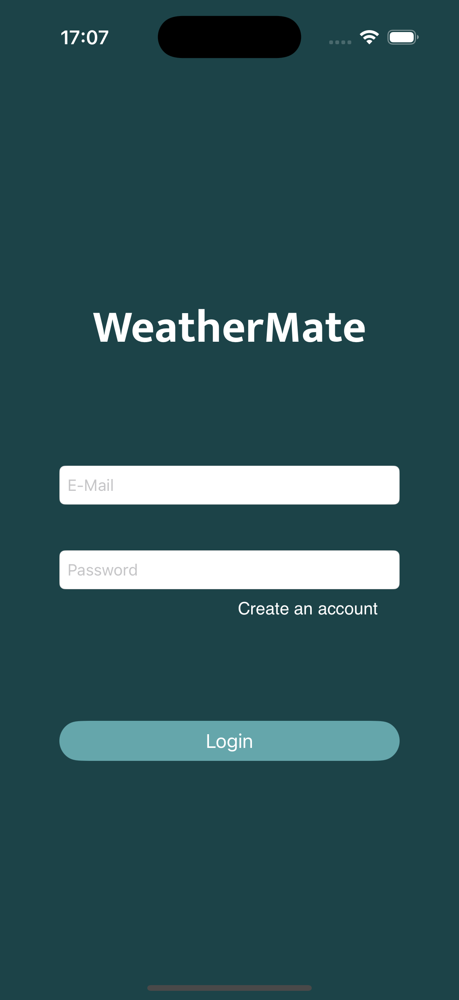
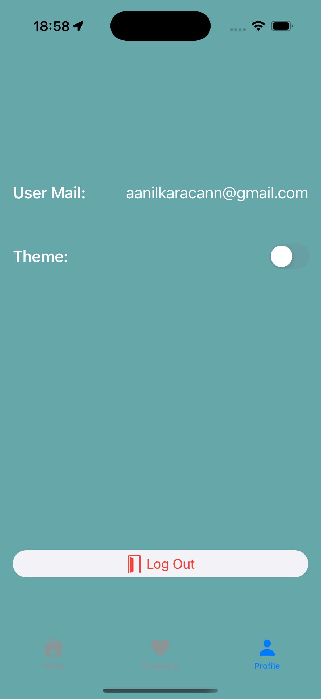

# WeatherMate

## Overview

**WeatherMate**  is an iOS application that provides real-time weather updates using the OpenWeather API. Users can view the current weather of their location, search for weather in other cities, and save favorite locations for quick access. The app also features Firebase Authentication for secure login and signup, as well as Firestore for storing user preferences.

## Screenshots

        

## Screen Record
<video src="https://raw.githubusercontent.com/anilkrcn/WeatherMate/main/WeatherMate/Videos/AppReview720p.mp4" width="300" autoplay loop muted></video>

**Dark Mode**

 

## Features

- **Real-Time Weather Updates:** Displays the current weather for the user's location on the main screen.
- **City Search:** Allows users to search for weather data by city name.
- **Favorites Management:** Save and view favorite cities along with their weather data.
- **Firebase Integration:** Secure login and signup functionality with Firebase Authentication.
- **Data Storage:** Favorites stored in Firebase Firestore for easy access across sessions.
- **Dark/Light Mode Toggle:** Users can switch between light and dark modes from the profile screen.

## Technologies Used

- **Swift:** Core language for development
- **UIKit:** User interface framework
- **Firebase:** Authentication and Firestore database
- **OpenWeather API:** Fetching real-time weather data
- **Core Location:** Fetching the user's current location
